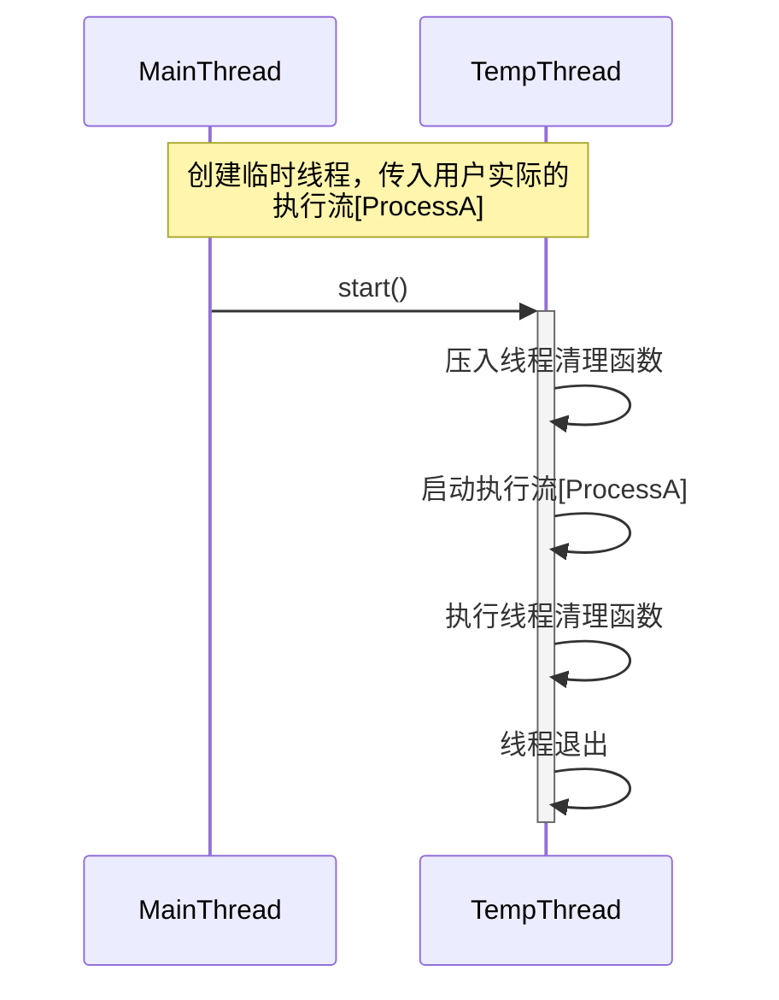
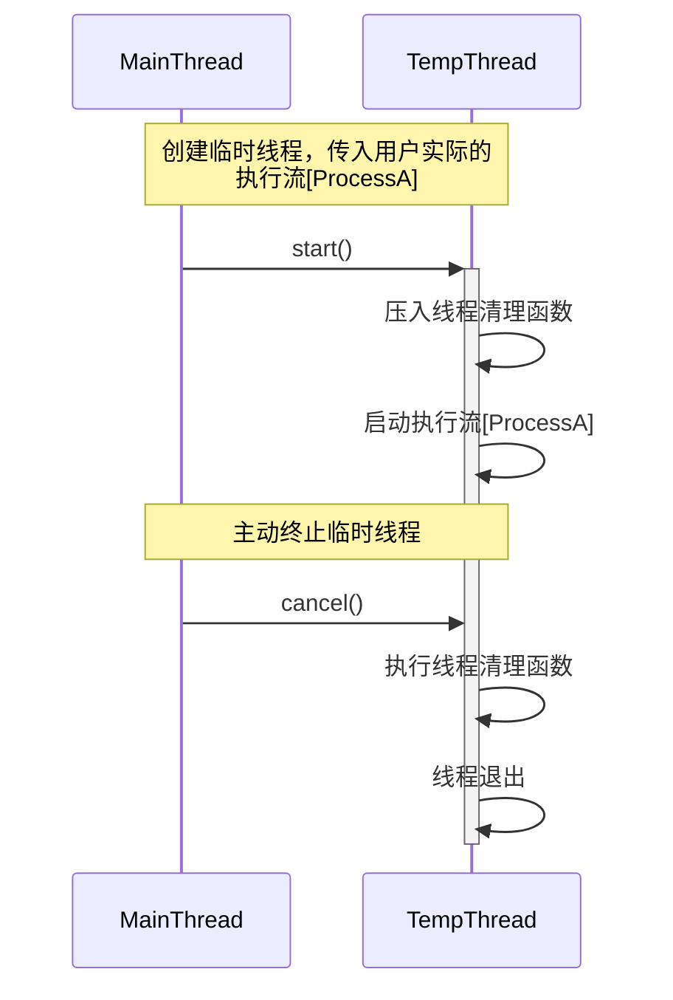

```mermaid
sequenceDiagram
    participant M as MainThread
    participant T as TempThread
    Note over M,T: 创建临时线程，传入用户实际的<br>执行流[ProcessA]
    M->>+T:start()
    T->>T:压入线程清理函数
    T->>T:启动执行流[ProcessA]
    T->>T:执行线程清理函数
    T->>-T:线程退出
```

```mermaid
sequenceDiagram
    participant M as MainThread
    participant T as TempThread
    Note over M,T: 创建临时线程，传入用户实际的<br>执行流[ProcessA]
    M->>+T:start()
    T->>T:压入线程清理函数
    T->>T:启动执行流[ProcessA]
    Note over M,T: 主动终止临时线程
    M->>T:cancel()
    T->>T:执行线程清理函数
    T->>-T:线程退出
```